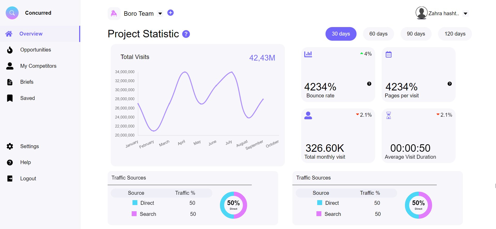

<h1 align="center">Dashboard</h1>



<div align="center">

  
  
  
  
  
</div>

## 📄 Project Description 
This project is a dynamic and interactive dashboard built using React.js, React Pro Side Bar, Chart.js, SASS, Material-UI, and
Framer Motion. It provides an intuitive and visually appealing interface for
displaying and analyzing data in a comprehensive manner.

## 🛠 Library Used
  
- <b> React Pro Side Bar: </b> This library is used to create a professional-looking and responsive sidebar navigation menu. It enhances the user experience by allowing easy navigation between different sections of the dashboard.

- <b> Chart.js: </b> It is employed to visualize data in various formats, such as line charts, and doughnut charts. The library offers a wide range of customizable options, enabling the representation of complex data sets in a clear and concise manner.

- <b> SASS: </b> SASS (Syntactically Awesome Style Sheets) is utilized for advanced CSS styling. It provides a more structured and efficient way of writing stylesheets, including variables, nesting, and mixins, which makes the styling process more maintainable and modular.

- <b> Material-UI: </b> A popular React UI framework, is employed for designing consistent and visually appealing components. It offers a rich set of pre-built components, including buttons, cards, and forms, which are utilized to enhance the dashboard's overall look and feel.

- <b> Framer Motion: </b> It is a powerful animation library for React that enables the creation of smooth and engaging animations. It is used to add interactive and eye-catching motion effects to various elements of the dashboard, enhancing the overall user experience.


### 🔧 How To Use                                                                                                                                  
  From your command line, first clone this repo:

```bash
# Clone this repository
$ git clone gh repo clone kartik-raj7/roobafinance
# Navigate to the project directory
$ cd roobafinance
# Install the dependencies
$ npm install
# Start the deployment server
$ npm run dev
```
  Open your web browser and visit 'http://localhost:5173/'
  

